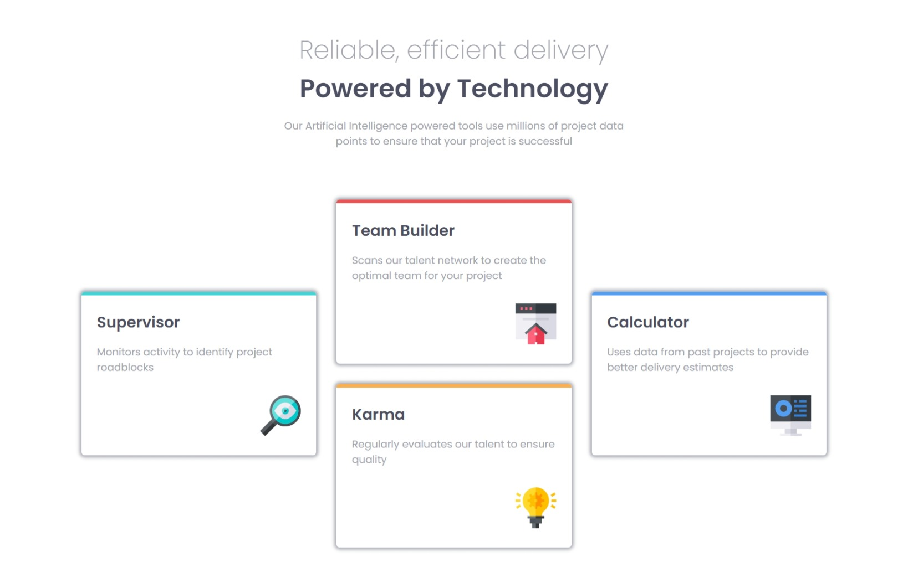

# Frontend Mentor - Four card feature section solution

This is a solution to the [Four card feature section challenge on Frontend Mentor](https://www.frontendmentor.io/challenges/four-card-feature-section-weK1eFYK). Frontend Mentor challenges help you improve your coding skills by building realistic projects. 

## Table of contents

- [Overview](#overview)
  - [The challenge](#the-challenge)
  - [Screenshot](#screenshot)
  - [Links](#links)
- [My process](#my-process)
  - [Built with](#built-with)
  - [What I learned](#what-i-learned)
- [Author](#author)


## Overview

### The challenge

Users should be able to:

- View the optimal layout for the site depending on their device's screen size

### Screenshot




### Links

- Solution URL: [Solution URL](https://github.com/awwsman/four-card-component.git)
- Live Site URL: [Live site URL ](https://awwsman.github.io/four-card-component/)

## My process

### Built with

- Semantic HTML5 markup
- CSS custom properties
- CSS Grid
- Desktop First Approach


### What I learned

I learned how to create an empty grid-template-area using dot(.)


```css
.container{
    grid-template-areas: 
    ". team ."
    "supervisor  team calculator"
    "supervisor karma calculator"
    ". karma .";
}
```


## Author


- Frontend Mentor - [@awwsman](https://www.frontendmentor.io/profile/awwsman)


